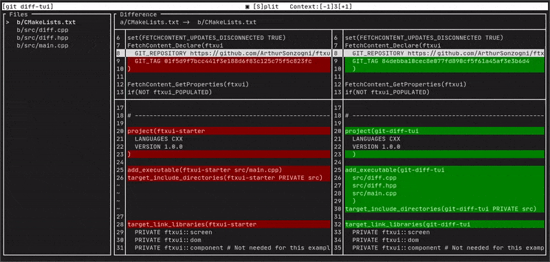

<p align="center">
  <br><br>
</p>

<h1 align="center">git tui</h1>

<h3 align="center">
  A collection of human friendly terminal user interface for git.
</h3>

<p align="center">
  <a href="https://github.com/ArthurSonzogni/git-tui/actions?workflow=linux-clang.yaml">
    
  </a>
  <a href="https://github.com/ArthurSonzogni/git-tui/actions?workflow=linux-gcc.yaml">
    
  </a>
  <a href="https://github.com/ArthurSonzogni/git-tui/actions?workflow=mac-clang.yaml">
    
  </a>
  <a href="https://github.com/ArthurSonzogni/git-tui/blob/master/LICENSE.md">
    
  </a>
</p>

<p align="center">
  <a href="#demo"><b>Demo</b></a>&nbsp;&bull;
  <a href="#install"><b>Installation</b></a>&nbsp;&bull;
  <a href="#usage"><b>Usage</b></a>&nbsp;&bull;
  <a href="#contribute"><b>Contribute</b></a>
</p>

# Demo

### gittui diff


# Install

### Snap:
[](https://snapcraft.io/git-tui)
```bash
sudo snap install git-tui
```
### From binaries:

10 different packages (deb, rpm, sh, zip, tar.gz, etc...): [Latest](https://github.com/ArthurSonzogni/git-tui/releases/latest).

### From source:
```bash
git clone https://github.com/ArthurSonzogni/git-tui;
cd git-tui;
mkdir build;
cd build;
cmake ..;
sudo make install -j;
```
# Usage

Replace `git` by `git tui` and use the usual commands and arguments.

Available commands:
```bash
git tui diff
```
```bash
git tui log 
```

More to be added...

# Contribute

If you like `git tui` and you find it useful, there are ways for you to contribute. You can suggest improvement or propose your own pull requests.
